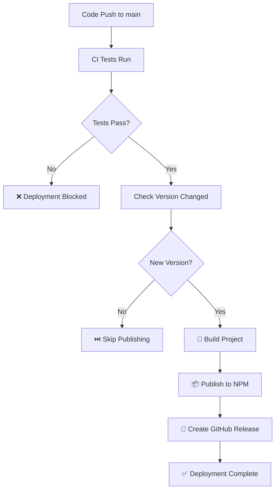

# Deployment & CI/CD Setup

This project uses GitHub Actions for automated testing, building, and publishing to npm.

## 🔧 **Required Setup**

### 1. **NPM Token Configuration**

You'll need to create an npm access token and add it to GitHub secrets:

#### **Create NPM Token:**
1. Log in to [npmjs.com](https://www.npmjs.com/)
2. Go to your profile → Access Tokens
3. Click "Generate New Token"
4. Choose "Automation" (for CI/CD publishing)
5. Copy the generated token

#### **Add to GitHub Secrets:**
1. Go to your GitHub repository
2. Settings → Secrets and variables → Actions
3. Click "New repository secret"
4. Name: `NPM_TOKEN`
5. Value: [paste your npm token]

### 2. **Repository Configuration**

The GitHub Actions workflows are already configured and will run automatically when you:
- Push to `main` branch
- Create a pull request
- Create a new release

## 🚀 **Automated Workflows**

### **CI Workflow (`.github/workflows/ci.yml`)**
- **Triggers**: Push to main/develop, Pull Requests
- **Tests on**: Node.js 18, 20, 22
- **Actions**:
  - TypeScript compilation check
  - Build verification
  - Ping functionality test
  - Package structure validation

### **Publish Workflow (`.github/workflows/publish.yml`)**
- **Triggers**: Push to main, New releases
- **Actions**:
  - Build the project
  - Check if version already exists on npm
  - Publish to npm (only if version is new)
  - Create GitHub release automatically

## 📦 **Release Process**

### **Option 1: Automated Release Script (Recommended)**

Use the provided release script for seamless version management:

```bash
# Patch release (1.0.0 → 1.0.1)
npm run release:patch

# Minor release (1.0.0 → 1.1.0)
npm run release:minor

# Major release (1.0.0 → 2.0.0)
npm run release:major
```

**What the script does:**
1. ✅ Checks you're on main branch
2. ✅ Ensures working directory is clean
3. 🔨 Builds the project
4. ⬆️ Bumps version in package.json
5. 📝 Creates commit with version bump
6. 🏷️ Creates and pushes git tag
7. 📤 Pushes to GitHub
8. 🤖 Triggers automatic npm publishing

### **Option 2: Manual Version Bump**

```bash
# Update version manually
npm version patch  # or minor/major

# Push with tags
git push origin main --tags
```

### **Option 3: GitHub Release**

1. Go to GitHub → Releases → "Create a new release"
2. Create a new tag (e.g., `v1.0.1`)
3. Generate release notes
4. Publish release
5. GitHub Actions will automatically publish to npm

## 🔄 **Deployment Flow**



## 📋 **Version Strategy**

- **Patch** (1.0.0 → 1.0.1): Bug fixes, small improvements
- **Minor** (1.0.0 → 1.1.0): New features, backwards compatible
- **Major** (1.0.0 → 2.0.0): Breaking changes

## 🔍 **Monitoring Deployments**

### **GitHub Actions**
- Go to your repository → Actions tab
- Monitor workflow runs and check logs
- Green ✅ = successful deployment
- Red ❌ = failed deployment (check logs)

### **NPM Package**
- Check [npmjs.com/package/homebridge-serverstatus](https://www.npmjs.com/package/homebridge-serverstatus)
- Verify new version is published
- Check download statistics

### **GitHub Releases**
- Repository → Releases
- Automatic releases created for each version
- Release notes generated automatically

## 🛠️ **Troubleshooting**

### **"NPM_TOKEN not found" Error**
- Verify you've added the NPM_TOKEN secret to GitHub
- Check the token hasn't expired
- Ensure token has "Automation" permissions

### **"Version already exists" Message**
- This is normal - prevents duplicate publishes
- Bump version number to publish new release
- Use `npm run release:patch` for automatic version bump

### **Build Failures**
- Check TypeScript compilation errors
- Verify all dependencies are properly installed
- Review the CI logs for specific error messages

### **Permission Errors**
- Ensure your npm token has publish permissions
- Verify you have access to publish the package name
- Check if package name is available on npm

## 🎯 **Best Practices**

1. **Always test locally** before pushing to main
2. **Use semantic versioning** for version numbers
3. **Write meaningful commit messages**
4. **Review CI logs** if deployment fails
5. **Test the published package** after deployment

## 📞 **Support**

If you encounter issues with the deployment process:
1. Check the GitHub Actions logs
2. Verify your npm token is valid
3. Ensure package.json version is unique
4. Review this documentation

---

**🤖 Automated deployment powered by GitHub Actions** 